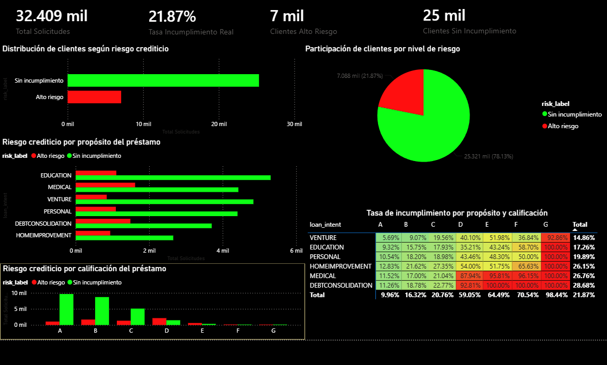

# Credit Risk Prediction using Machine Learning, MongoDB Atlas and Power BI
## Overview

This project presents an end-to-end credit risk analytics solution developed using Python, MongoDB Atlas, Power BI, and Machine Learning.

The objective is to identify customers with a high probability of loan default and provide insights that support financial risk assessment and decision-making.

## Technologies Used

- Python
- Pandas
- NumPy
- Scikit-Learn
- Matplotlib
- Seaborn
- MongoDB Atlas
- PyMongo
- Power BI
- Google Colab
- Jupyter Notebook
- CSV / JSON
  
### Machine Learning Techniques

- Logistic Regression
- Random Forest Classifier
- Train/Test Split
- StandardScaler
- One-Hot Encoding
- Confusion Matrix
- Feature Importance Analysis

  ## Dashboard

The Power BI dashboard was developed to monitor credit risk distribution, loan purposes, default rates, and customer segmentation based on financial risk indicators.

## Key Results

- More than 32,000 loan applications analyzed.
- Default rate identified through risk segmentation.
- Random Forest achieved the highest predictive performance.
- Important financial risk indicators were identified through feature importance analysis.
- Credit risk dashboard developed using Power BI.
- End-to-end integration between MongoDB Atlas, Python, and Power BI.

## Skills Demonstrated

- Data Analytics
- Business Intelligence
- Machine Learning
- Risk Analytics
- Financial Analytics
- Data Visualization
- MongoDB Atlas Integration
- Data Cleaning & Preparation
- Predictive Modeling
- Dashboard Development

## Future Improvements

- Compare additional machine learning models.
- Deploy the model as a web application.
- Automate dashboard refresh processes.
- Expand financial risk indicators and model monitoring.

## Author

Juan Sebastián Cruz Murillo

Data Science Engineering Student | Trilingual Quality Assurance Analyst
